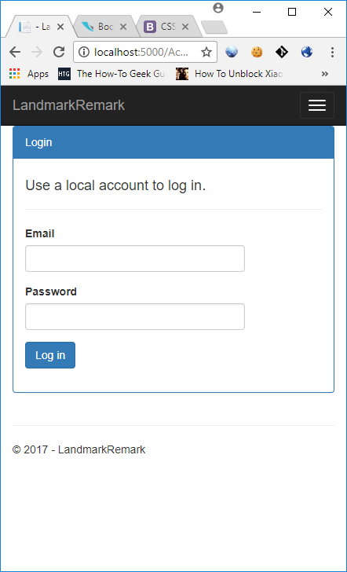

# landmark-remark
A sample ASP.NET MVC Core web application to show how apply Clean Architecture, Screaming Architecture, Vertical Slicing, CQRS and SOLID pricincples

# Introduction

Landmark Remark is a ASP.NET MVC Core web application optimized for mobile device to do the followings:

1. As a user (of the application) I can see my current location on a map
1. As a user I can save a short note at my current location
1. As a user I can see notes that I have saved at the location they were saved on the map
1. As a user I can see the location, text, and user name of notes other users have saved
1. As a user I have the ability to search for a note based on contained text or user name

It is a sample application I created to learn how to create an application based on  
[Clean Architecture](https://8thlight.com/blog/uncle-bob/2012/08/13/the-clean-architecture.html), [Screaming Architecture](https://8thlight.com/blog/uncle-bob/2011/09/30/Screaming-Architecture.html),
[Vertical Slicing](https://www.kenneth-truyers.net/2016/02/02/vertical-slices-in-asp-net-mvc/), CQRS, SOLID principles, and
my past experience developing the web applications.

## Log in

## Show current location and enter remark

## Show my remarks

## Show remarks of other users

## Search remarks

# Installation
1. Install Visual Studio 2017 Professional
1. Install SQL Server 2016 Express
1. Install the database located at src\LandmarkRemark.Web\wwwroot\App_Data\landmark.mdf
1. Edit the connection string at src\LandmarkRemark.Web\databasesettings.json
1. Open src\LandmarkRemark.sln using Visual Studio 2017
1. Log in as `john1@gmail.com`, `john2@gmail.com`, or `john3@gmail.com` using password `password`
1. You must **enable location services of the testing browser**. Eg if you use Chrome, refer to the link to enable the location service: http://www.wikihow.com/Enable-Location-Services-on-Google-Chrome

# Technoloiges Used
* ASP.NET MVC Core
* jQuery
* Google Map Javascript API and HTML5 Geolocation API
* Dapper
* Microsoft.AspNetCore.Authentication.Cookies (for FormAuthentication)
* MediatR
* Newtonsoft Json.net
* FluentValidation
* Log4net
* Autofac

# Software Principles and Best Practices Used in the Project

* Apply Clean Architecture of Robert Martin
	* The source code has a dependency on source code one layer below it
	* Business logic (entity and use case layear) is devoid of infrastructure concern
* Emphasize on use cases (Screaming Architecture / vertical slicing)
	* The architecture prominently reveal the intents of the application
	* Code the use case first. If there is re-use, the codes are refactored into Entity layer
* Apply CQRS (command query responsibility segregation) with MediatR to divide the data and behaviour
	* Use the mediator pattern (MediatR library) to decouple the sending of command and the processing of command
	* Repositories are replaced with commands and command handlers
* Apply SOLID principles when necessary
* Use dependency injection framework to manage the source code dependency

## What is Clean Architecture
* Architecture that is designed for the inhabitants of the architecture, 
	* Not for the architect 
	* Not for the framework
	* Nor the machine
	Meaning, it is designed for the developers of the system
* Characteristic of Clean Architecture
	* Independent of Frameworks
	* Testable
	* Independent of UI.
	* Independent of Database
	* Independent of any external agency

## Screaming Architecture
Architecture should reveal the intent of the requirements, instead of cluttered by the conventioan of the framework.

In order to achieve this, the use cases should sit in the top level folder in the source code. 
We can employ Vertical Slicing to achieve this. Vertical Slicing means the source codes are partitioned by use cases as much as 
possible. C# file, script, HTML, CSS are located in the same folder of the use cases. Usually a change in the use case
involves changes in multiple layer: javascript, CSS, controller, etc. It is best to group the functional cohesive codes to enable easier changes to the systems when the system becomes bigger and more complex. It is also simpler to understand the software.

In the presentation layer, the project is divided into several feature folders. 
One feature folder can implement one or more use cases. So the feature folder can access to one or more use cases in the use case layer.

In the use case layer, each use case occupies one use case folder. Use case layer may reference entity layer. 

In the entity layer, where the re-usable business logic resides, each root of aggregate occupies one folder.

The development should be driven by use cases. It mean that we should put more emphasis on modelling of the 
use cases. The use case should always be implemented, and the domain logic / entity layer is not allowed
to be leaked into presentation layer. This makes the presentation layer very lean, and most of the logic is located
in use case layer. For simple project, it is OK if we implement all logic in the use case layer. 
When we find out the there are duplication of codes, then we may refactor them into entity layer.

Without a domain model, or without a complete domain model in the entity layer, it does not mean there isn't a
domain model. We should still analyze the domain model and identify the root of aggregate. The domain model
can be virtual and conceptual, i.e. analyzed but not fully materialized as entities. This can help eliminate code duplication 
in entity and use case layer. We only code something when it is really used. However, if the team is not comfortable
with this virtual domain model approach, they can still implement the full domain model in entity layer.

The emphasis on use cases does not preclude us from performing the domain modelling and have a very rich domain model. 
The one thing we must follow is that use case layer is always implemented and optimized for the presentation, 
and no domain logic is allowed to be leaked into presentation layer, so that presentation layer can be simplified.

## Command Query Responsibilities Segregation (CSRS) is Used in Conjunction with a Event Bus

Here a small library MediatR is used to provide in-process event bus, so that we can decouple the
command/query and the handler (the business logic). MediatR is used since it is small library and very 
customizable.

Class is seperated into command and query. There is no repository class. Each method in the repository
will be substituted by one command/query plus the corresponding command/query handle.
Likewise, each use case will be represented by
one command/query plus the corresponding command/query handler. For command request, it is named as
XxxCommand; for query request, it is named as XxxQuery. This convention allows us to clearly
differentiate whether the request is a command or query by just looking at the class name.

Separating the command from the handler also make the serialization of command very easy. 
When the command is easily serializable, we can change the architecture to message queue easily.

Using CQRS also enables us to have a small and cohesive class, compared to using repository pattern.
In a repository, a lot of business logic is put into a single class. It is not uncommon to have 
many methods in one single repository for complex project. This makes testing and understanding
the codes difficult.

Each command/request handler is a transaction boundary. No transaction API is exposed from the public
API of use case or entity layer. It is because database transaction is a leaked abstraction, causing
business layer to be aware of the implementation details.

## Dependency Management

Each layer is only allowed to access the source code **one layer below it**. This means that the presentation
layer can access the public API of use case layer, but it cannot access those of entity layer. 
This ensures that the presentation layer is always accessing the source code optimized for it (use case layer),
and it is not cluttered with domain model which sometimes gives the the presentation layer more information
or methods than it requires.

Presentation layer depends only on use case layer, without additional dependency of entity layer. 
This reduces the dependency surface of the presentation layer. 

Entity and use case layers are friend to bootstrapping layer. Bootstrapping layer is used to manage the 
dependency using Autofac. To make a friend to bootstrapping layer, use the following attributes in 
the respective assembly, 
	`[assembly: System.Runtime.CompilerServices.InternalsVisibleTo("LandmarkRemark.Bootstrapping")]`

Infrastructure layer contains any method used to access the database, web services, and/or other technologies related
API. The implementation of use case and entity layers have access to infrastructure layer. However, all the public interfaces
of entity and use case layer do not depend on the infrastructure layer. In this project, the infrastructure contains only
the connection factory. If Entity Framework Core is used, the DbContext should be placed here, so that the public API
of entity and use case layers do not depend on the Entity Framework Core.

Cross cutting layer contains API which can be used by all other layers, eg. clock or timing funtions.

# TODO
The current project focuses on applying the best practices on the use case, entity, and server side presentation layer.
The client side artefacts eg CSS, HTML and Javascript is still not vertical slicing friendly.
I will improve this by converting the applicaiton into Single Page Application using Angular with all the scripts and
CSS file located in the feature folder, side by side with server side artefacts.

